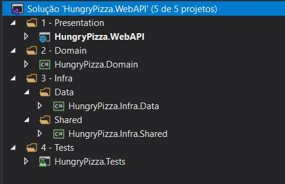
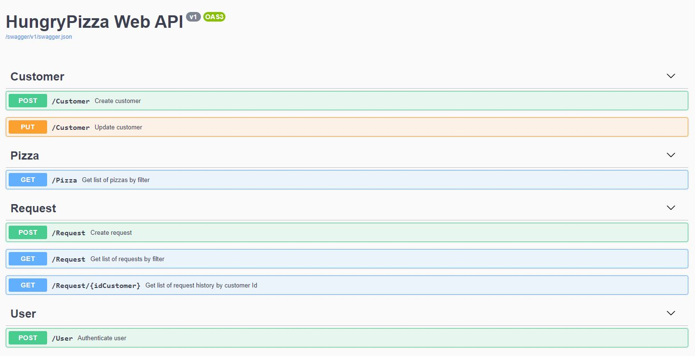

# HungryPizza

## PROJETOS DA SOLUÇÃO

• **HungryPizza.Domain**: Biblioteca. Contém as entidades, commands, queries, handlers e validações utilizados pelos demais projetos.

• **HungryPizza.Infra.Data**: Biblioteca. Possui classes referentes ao repositório e conexão com o banco de dados.

• **HungryPizza.Infra.Shared**: Biblioteca. Possui classes comuns a todos os projetos.

• **HungryPizza.Tests**: Testes automatizados. Permite testar os commands, queries e controllers utilizando dados mockados.

• **HungryPizza.WebAPI**: Web API. Permite testar através do Swagger as operações de cadastro e edição de cliente, autenticação de usuário, criação de pedido e listagem de histórico.

## TECH STACK

- .NET Core 3.1
- Swagger
- AutoMapper
- MediatR
- FluentValidation
- Entity Framework
- MySQL
- xUnit
- AutoMoq

## PATTERNS/DESIGNS

- S.O.L.I.D.
- CQRS
- Domain Driven Design
- Notification Pattern

## INSTRUÇÕES

A solução requer conexão com o banco de dados MySQL para ser testada pelo Swagger.  
A pasta "DB" contém o arquivo _script.sql_ e o diagrama de tabelas. É necessário executar o script no MySQL Workbench ou qualquer outro gerenciador de banco de dados MySQL para contruir o schema, cadastrar as pizzas e poder realizar os testes por completo.
A string de conexão deve ser fornecida no arquivo _appsettings.json_ do projeto **HungryPizza.WebAPI**.

```js
"ConnectionStrings": {
    "DefaultConnection": "<CONNECTION_STRING_HERE>"
},
```

## ESTRUTURA



## SWAGGER



Todos os métodos possuem exemplo de entrada.  
Para cadastrar um cliente, utilize o controller _Customer_.  
O histórico de pedidos requer um cliente cadastrado e é acessado através da rota _/Request/{idCustomer}_ do controller _Request_.  
O método de autenticação de usuário no controller _User_ é apenas um recurso a mais, não necessário para o funcionamento do sistema.
